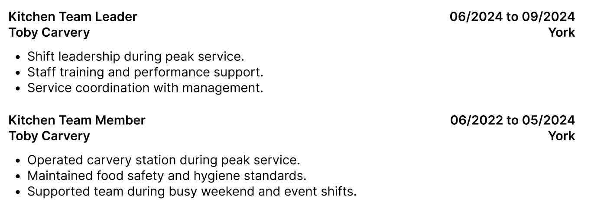

### Navigation

- Nothing mean to say here really, I like it

### Hero

- it's not just MEng engineering, but mechatronics and robotics engineering
- not too sure about the font for the name
- the description could be a lot better as well

### About

- I really like this, buit I'm wondering if there is a better way to show the key module grades

### Projects

- really like this one

### Skills

- like this one as well

### Experience

- might be good to add the toby Carvery stuff
  

### General

- I like the mono -font, but not sure about the serif and the colour scheme
